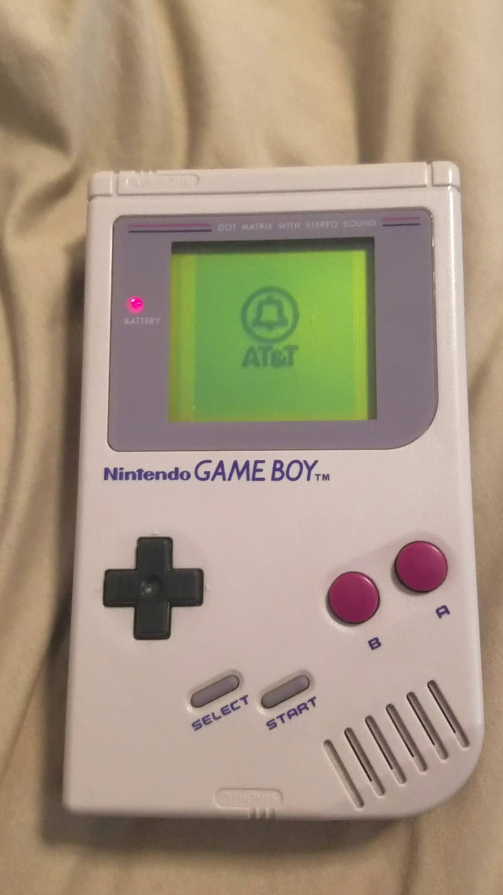

<a href="https://www.youtube.com/watch?v=3XywOHrW2V0">
    
</a>

Code is in main.asm. The other stuff is me disassembling Avik Das'
example + disassembling the bootstrap ROM to figure out what I need in
main.asm to set up audio, play sounds, render tiles, scroll screen.


```
$ make
```

Open main.gb.

## Resources

- Tile data generator http://www.chrisantonellis.com/gameboy/gbtdg/ 
- Pandocs http://bgb.bircd.org/pandocs.htm
- GB opcode summaries
  http://pastraiser.com/cpu/gameboy/gameboy_opcodes.html
  http://www.devrs.com/gb/files/opcodes.html
- Bootstrap ROM disassembly (for sound tones)
  http://gbdev.gg8.se/wiki/articles/Gameboy_Bootstrap_ROM

## Todo

Hijack the BIOS at startup. Should be doable with breakout board and
FPGA?

